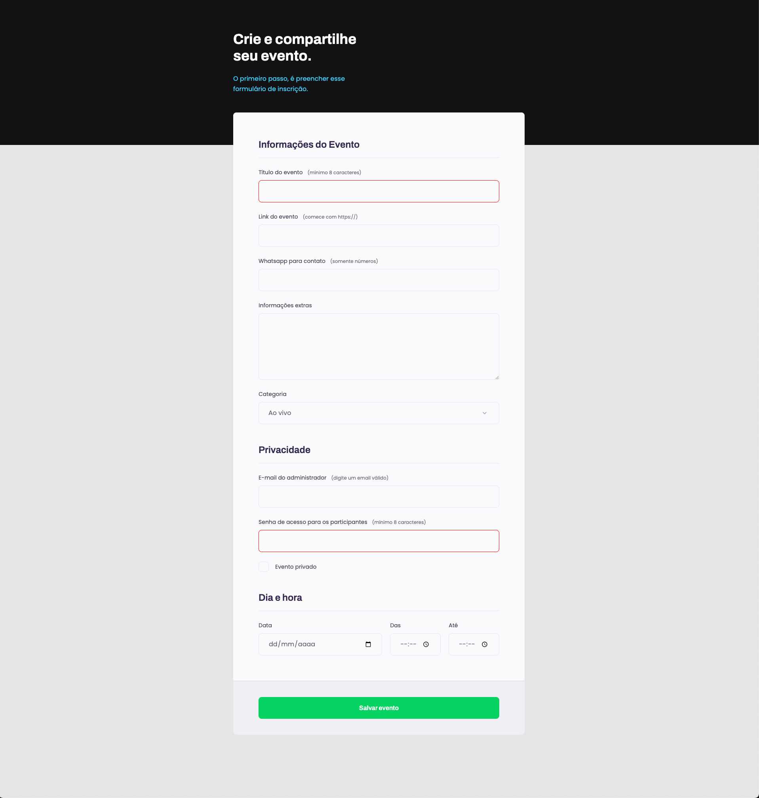

<h1 align="center">
Formulário "Crie seu evento"
</h1>

  
   

  <a href="#-tecnologias">Tecnologias</a>&nbsp;&nbsp;&nbsp;|&nbsp;&nbsp;&nbsp;
  <a href="#-projeto">Projeto</a>

 

  

## 💻 Projeto

Este é um projeto web para criação e compartilhamento de eventos. O objetivo principal é permitir que os usuários criem eventos, preenchendo um formulário intuitivo. O projeto é estilizado de acordo com um layout previamente definido no Figma e faz uso de HTML e CSS para criar uma experiência de usuário agradável e responsiva.

Este projeto é uma excelente demonstração de design de interface de usuário e desenvolvimento web responsivo. É adequado para qualquer pessoa que queira criar e compartilhar eventos online de forma fácil e eficaz.

Para acessar o projeto, clique [aqui!](https://d-henrique.github.io/Formulario-eventos/)

## 🚀 Tecnologias

Esse projeto foi desenvolvido com as seguintes tecnologias:

- HTML
- CSS

## 🛠️ Recursos Principais:

- Formulários de inscrição de eventos com validação de dados.
- Seleção de categoria de evento.
- Opção para marcar eventos como privados.
- Botão de submissão para salvar os eventos.

---

Feito com ♥ by Doug Moreira e Rocketseat 👋 [Participe da nossa comunidade!](https://discordapp.com/invite/gCRAFhc)
